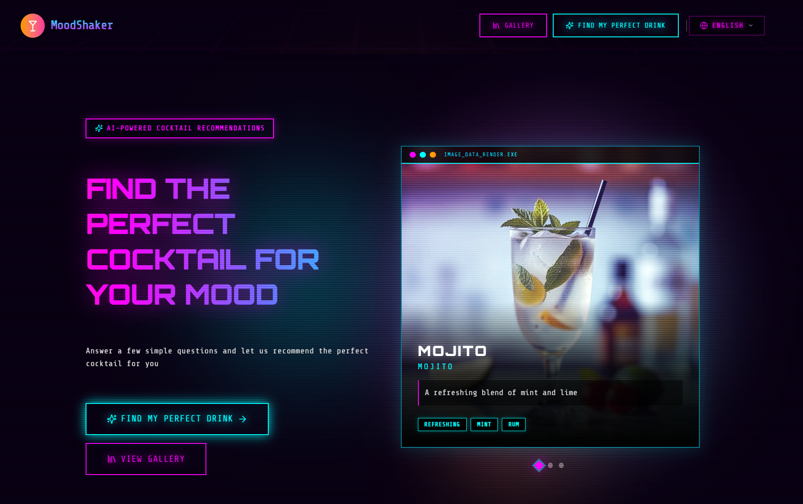
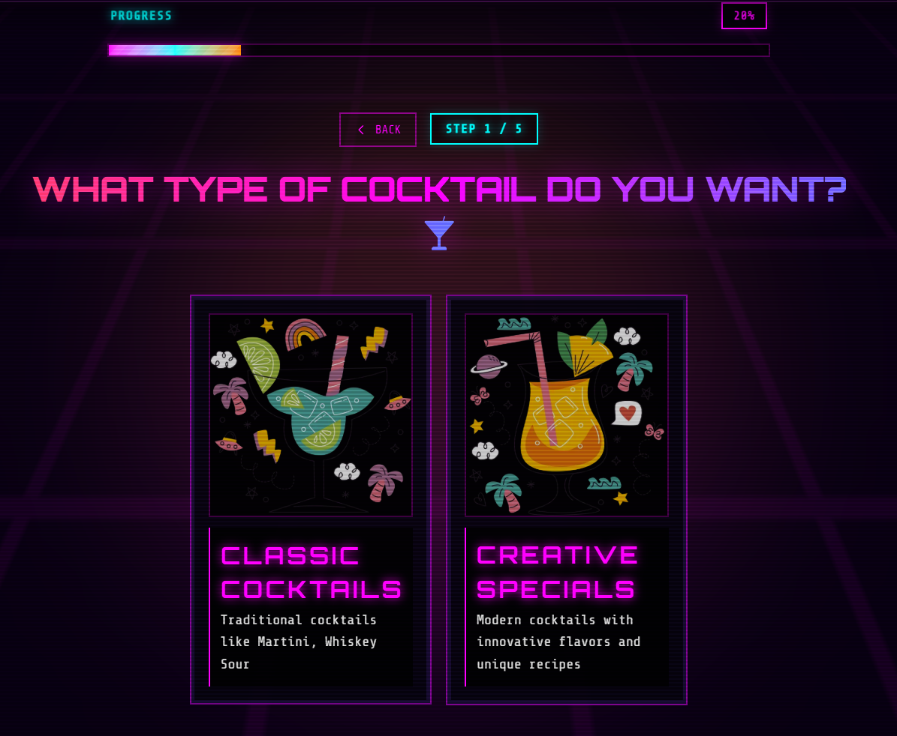
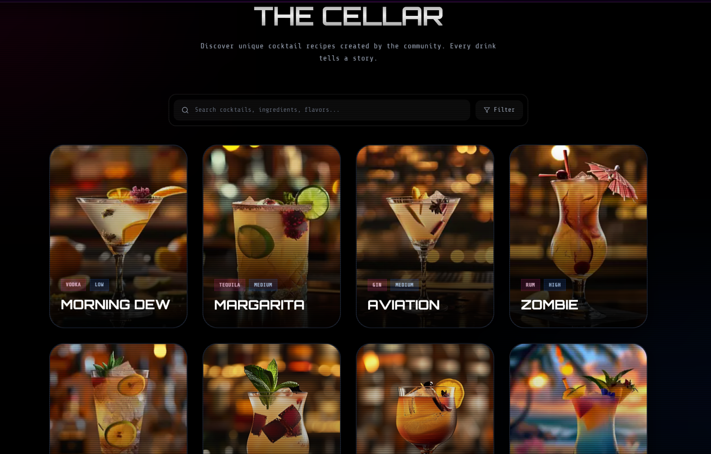
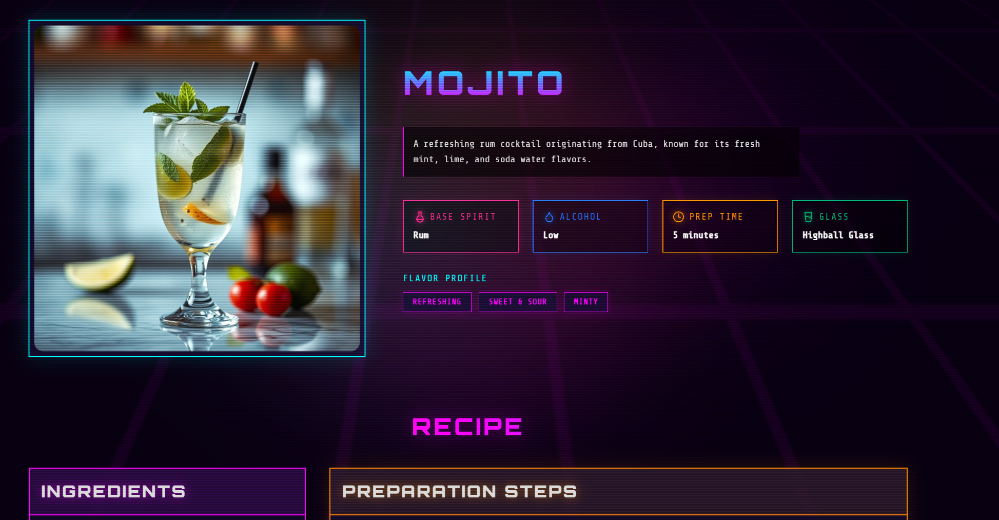

# 🎭 MoodShaker - 你的心情调酒师

> "生活就像一杯鸡尾酒，有时候需要一点调味，有时候需要一点摇晃，但最重要的是要找到属于自己的配方。"

## 🎨 这是什么？

MoodShaker 是一个让你心情变好的神奇应用！就像一位专业的 AI 调酒师，它能够根据你的心情，为你调制出最适合的"心情鸡尾酒"。无论是开心、难过、焦虑还是兴奋，MoodShaker 都能帮你找到最合适的解决方案。

不需要你是调酒大师，也不需要复杂的知识，只需要跟着我们的向导，回答几个简单的问题，一杯完美契合当下的鸡尾酒就会出现在你面前。

## 📸 项目导览

### 1. 欢迎来到 MoodShaker

首页是我们旅程的起点。在这里，你可以选择"开始探索"来获取 AI 推荐，或者直接去"酒单库"看看大家的收藏。


### 2. 告诉我们你的心情

点击"开始探索"后，AI 会问你几个简单的问题。你是想喝点经典的，还是来点创意的？你的心情如何？


### 3. 探索酒单库 (The Cellar)

在画廊页面，你可以看到各种各样的鸡尾酒。你可以根据基酒（如金酒、伏特加）或口味（如甜、酸）来筛选你喜欢的饮品。


### 4. 制作你的鸡尾酒

当你选中一款鸡尾酒，我们提供详细的配方、所需的工具和一步步的制作说明。不仅如此，还能了解到这杯酒背后的故事。


## ✨ 主要特点

- **🧠 AI 智能推荐**: 懂你的心情，更懂你的口味。
- **📱 完美适配手机与电脑**: 无论在地铁上还是沙发上，随时随地都能用。
- **🎨 现代化设计**: 简洁、优雅的暗色主题界面，保护视力又充满高级感。
- **📚 丰富的知识库**: 不只是喝，还能学到鸡尾酒文化。
- **🌍 多语言支持**: 支持中文和英文，方便不同用户使用。

## 🚀 快速开始（新手指南）

如果你想在自己的电脑上运行这个项目，请按照以下步骤操作：

### 第一步：准备工作

确保你的电脑上安装了 `Node.js` (建议版本 18 以上)。

### 第二步：下载项目

```bash
git clone https://github.com/Tendo33/MoodShakerFront
cd MoodShakerFront
```

### 第三步：配置环境

你需要配置 AI 和数据库连接。

1. 找到项目文件夹里的 `.env.example` 文件。
2. 把它重命名为 `.env`。
3. 用记事本打开它，填入你的配置信息：
   - **OpenAI 配置**: `OPENAI_API_KEY`, `OPENAI_BASE_URL` (用于生成配方)
   - **图像生成配置**: `IMAGE_API_KEY` (用于生成鸡尾酒图片)
   - **数据库配置**: 确保 `DATABASE_URL` 指向你的 PostgreSQL 数据库

### 第四步：初始化数据库

项目需要数据库支持。请确保你的 PostgreSQL 数据库正在运行，然后执行：

```bash
# 初始化数据库 (生成客户端、迁移表结构、填充初始数据)
pnpm db:init
```

### 常见问题排查（Troubleshooting）

如果你在开发日志里看到类似以下错误：

```text
PrismaClientKnownRequestError (P2022)
The column `cocktails.thumbnail` does not exist in the current database.
```

说明本地数据库结构还没同步到最新迁移。请执行以下任一命令进行修复：

```bash
# 推荐：完整初始化（生成客户端 + 迁移 + seed）
pnpm db:init

# 或仅执行 Prisma 迁移
pnpm prisma:migrate
```

### 第五步：启动！

在终端（Terminal）中输入以下命令：

```bash
# 安装需要的工具包 (如果还没安装)
pnpm install

# 启动网站
pnpm dev
```

现在，打开浏览器访问 `http://localhost:3000`，你的专属调酒师就在那里等你！

## 🛠️ 技术栈

对于对技术感兴趣的朋友，我们使用了以下最前沿的技术：

- **框架**: Next.js 16 (React 19 的超集，更快更强)
- **语言**: TypeScript (给 JavaScript 加上了类型安全)
- **样式**: Tailwind CSS (写样式从未如此简单)
- **组件**: Radix UI & shadcn/ui (无障碍、高质量的组件库)

## 🤝 加入我们

想要成为我们的调酒师吗？欢迎提交 Pull Request！让我们一起调制出更多精彩的心情鸡尾酒！

## 📝 许可证

[MIT](https://opensource.org/licenses/MIT)

## 👨‍💻 作者

## [Tendo33](https://simonsun.cc)
