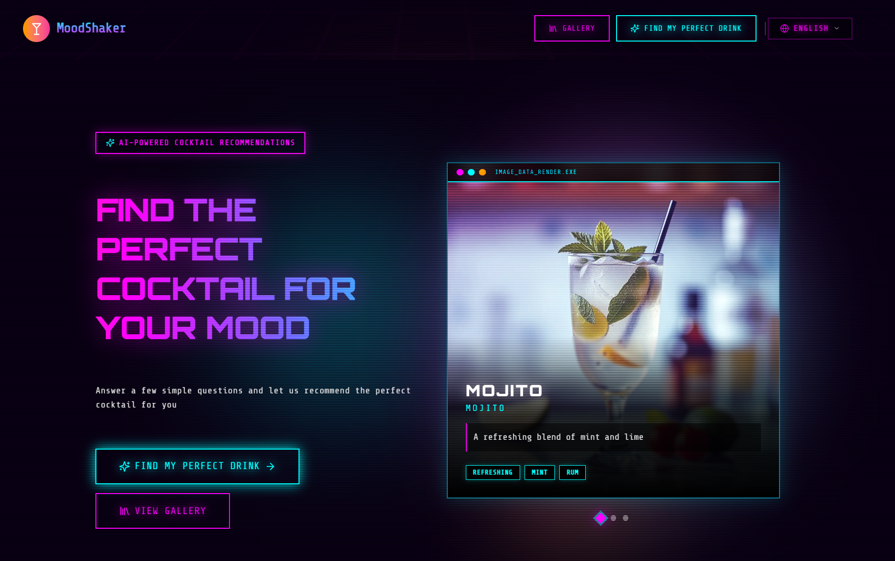
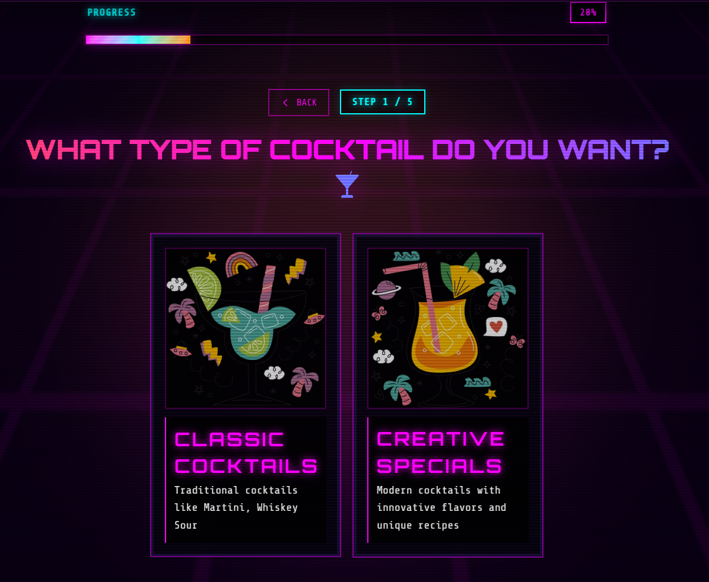
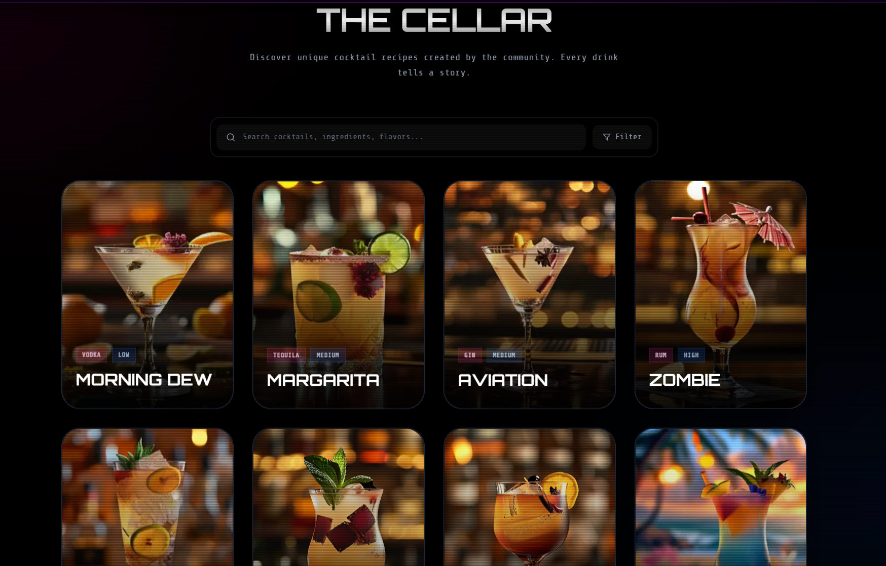
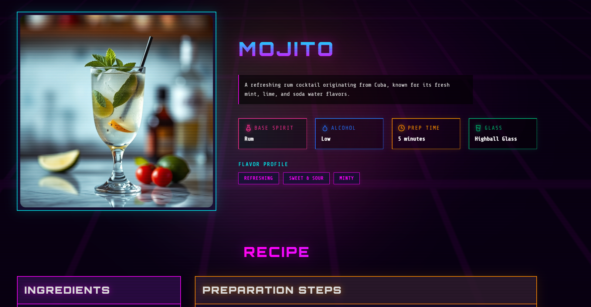
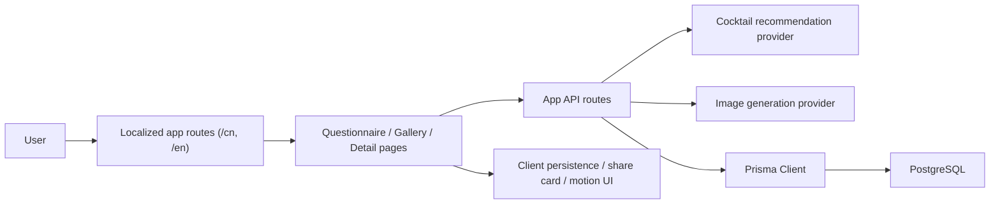

# MoodShaker Frontend

<div align="center">

An AI-powered bilingual cocktail experience that turns a quick mood check into a complete drink recommendation.

[](./README.zh.md)
[](https://nextjs.org/)
[](https://react.dev/)
[](https://www.typescriptlang.org/)
[](https://www.prisma.io/)
[](https://tailwindcss.com/)

[](#overview)
[](#current-status)
[](#quick-start)
[](#deployment-and-release)

</div>

## Overview

MoodShaker is a bilingual web app for cocktail discovery and recommendation. Instead of browsing a static recipe database first, users answer a short mood-based questionnaire and receive a personalized cocktail with ingredients, tools, steps, and a shareable visual card.

The project is built with Next.js App Router, React 19, TypeScript, Prisma, PostgreSQL, and a pair of AI-backed endpoints for recommendation and image generation. It also ships with a localized experience for Chinese and English users, a gallery for browsing drinks, and a detail page for revisiting recipes.

## Current Status

### Implementation status

- Batch 1 hardening is complete: local verification is restored, private recommendation access no longer puts `editToken` in the URL, unsafe wildcard CORS headers were removed, API 500s were standardized, and shared rate-limit storage was added.
- Lightweight automated verification is now part of the repo through `pnpm test`.
- Recommendation recovery is intentionally same-browser-session access. When local edit access is unavailable, the product now shows an explicit unavailable state instead of a silent failure.

### Release status

- Suitable for local development, staging, and controlled beta testing.
- Not yet recommended for a full production launch.

Formal release blockers are tracked in [docs/release-readiness.md](./docs/release-readiness.md).

## Highlights

- Two recommendation styles are supported through different bartender personas: `classic_bartender` and `creative_bartender`.
- Language-aware routing is built in, with `/cn` and `/en` paths plus automatic redirect logic in [proxy.ts](./proxy.ts).
- The main product flow is connected: landing page, questionnaire, recommendation page, gallery, cocktail details, and share card output.
- Recommendation access is private by default and requires both the recommendation id and a local edit token.
- Server responses use stable error codes and generic client-safe 500 messages.
- Recommendation and image endpoints emit rate-limit headers and can use shared Postgres-backed buckets.

## Screenshots

| Home | Questionnaire |
| --- | --- |
|  |  |

| Gallery | Cocktail Detail |
| --- | --- |
|  |  |

## Demo Flow

```text
Landing page
  -> mood questionnaire
  -> AI cocktail recommendation
  -> generated image + recipe details
  -> shareable card
  -> gallery browsing
  -> cocktail detail revisit
```

## Tech Stack

- Framework: Next.js 16 with App Router
- UI: React 19, Tailwind CSS 4, Framer Motion, Radix UI, Lucide
- Language: TypeScript
- Data layer: Prisma with PostgreSQL
- Data fetching: SWR
- AI integration: OpenAI-compatible chat endpoint and image generation endpoint
- Tooling: pnpm, ESLint, tsx, Docker Compose

## Architecture


```mermaid
flowchart LR
  A["User"] --> B["Localized app routes (/cn, /en)"]
  B --> C["Questionnaire / Gallery / Detail pages"]
  C --> D["App API routes"]
  D --> E["Cocktail recommendation provider"]
  D --> F["Image generation provider"]
  D --> G["Prisma Client"]
  G --> H["PostgreSQL"]
  C --> I["Client persistence / share card / motion UI"]
```

### Main runtime pieces

- App routes live under [app/[lang]](./app/%5Blang%5D) and provide the user-facing pages.
- API handlers live under [app/api](./app/api) and coordinate recommendation generation, detail lookup, image generation, and private recommendation retrieval.
- Shared UI lives in [components](./components), while app-wide state is managed in [context](./context).
- Database schema, migrations, seed data, and maintenance scripts are in [prisma](./prisma).
- Current remediation notes and performance tracking live under [docs](./docs).

## Project Structure

```text
app/
  api/
    cocktail/
    image/
    recommendation/
  [lang]/
    page.tsx
    questions/page.tsx
    gallery/page.tsx
    cocktail/[id]/page.tsx
    cocktail/recommendation/page.tsx
components/
  animations/
  layout/
  pages/
  share/
  ui/
context/
docs/
  plans/
  screenshots/
lib/
locales/
prisma/
public/
tests/
proxy.ts
```

## Quick Start

### 1. Prerequisites

- Node.js `>= 22`
- pnpm `>= 10`
- PostgreSQL `15+` or Docker

### 2. Install dependencies

```bash
pnpm install
```

`postinstall` runs `prisma generate`, so a clean install should produce a usable Prisma client automatically.

### 3. Configure environment variables

```bash
cp .env.example .env
```

Then fill in the required values in `.env`.

### 4. Prepare the database

Make sure PostgreSQL is running and `DATABASE_URL` is reachable:

```bash
pnpm db:init
```

This command will:

- generate the Prisma client
- apply migrations
- seed initial cocktail data

### 5. Start the development server

```bash
pnpm dev
```

Open [http://localhost:3000](http://localhost:3000). Requests to `/` are redirected to the proper language path, defaulting to `/cn`.

## Environment Variables

| Variable | Required | Description |
| --- | --- | --- |
| `OPENAI_API_KEY` | Yes | API key for the chat recommendation endpoint |
| `OPENAI_BASE_URL` | Yes | OpenAI-compatible base URL |
| `OPENAI_MODEL` | Yes | Chat model name |
| `IMAGE_API_URL` | Yes for image generation | Image generation endpoint |
| `IMAGE_API_KEY` | Yes for image generation | Image generation API key |
| `IMAGE_MODEL` | No | Image model name |
| `IMAGE_FETCH_HOST_ALLOWLIST` | Recommended | Comma-separated host allowlist for server-side image fetch and optimization |
| `DATABASE_URL` | Yes | PostgreSQL connection string |
| `HOST_PORT` | Optional | Exposed web port for Docker Compose |
| `POSTGRES_USER` | Optional | Database username for Docker Compose |
| `POSTGRES_PASSWORD` | Optional | Database password for Docker Compose |
| `POSTGRES_DB` | Optional | Database name for Docker Compose |

## Available Scripts

| Command | Description |
| --- | --- |
| `pnpm dev` | Start the local development server |
| `pnpm build` | Build the production bundle |
| `pnpm start` | Run the production build |
| `pnpm lint` | Run ESLint |
| `pnpm test` | Run the lightweight Node-based regression suite |
| `pnpm db:init` | Generate Prisma client, apply migrations, and seed data |
| `pnpm prisma:generate` | Generate Prisma client only |
| `pnpm prisma:migrate` | Apply Prisma migrations |
| `pnpm prisma:seed` | Seed cocktail data |
| `pnpm prisma:backfill-thumbnails` | Backfill the `thumbnail` field from stored images |

## API Endpoints

| Method | Endpoint | Purpose |
| --- | --- | --- |
| `POST` | `/api/cocktail` | Generate a cocktail recommendation from questionnaire input |
| `GET` | `/api/cocktail/:id` | Fetch a public cocktail detail record by id |
| `POST` | `/api/image` | Generate or refresh a recommendation image when the caller has edit access |
| `POST` | `/api/recommendation/:id` | Retrieve a private recommendation by id using an `editToken` in the JSON body |

### Security and behavior notes

- `editToken` is no longer accepted in the URL for private recommendation access.
- `POST /api/recommendation/:id` returns recommendation metadata without echoing the `editToken`.
- `POST /api/cocktail` is currently rate-limited by client IP.
- `POST /api/image` is rate-limited per recommendation id.
- In production, missing shared rate-limit storage is treated as a deployment error instead of silently falling back forever.

## Localization

- Supported languages are `cn` and `en`.
- [proxy.ts](./proxy.ts) detects language from the URL, cookie, and `Accept-Language` header.
- Requests without a language prefix are redirected to a localized route.
- Translation dictionaries live in [locales/cn.ts](./locales/cn.ts) and [locales/en.ts](./locales/en.ts).

## Deployment And Release

This repository already includes the essentials for containerized deployment:

- [Dockerfile](./Dockerfile) for multi-stage image builds
- [docker-compose.yml](./docker-compose.yml) for the web app and PostgreSQL
- [scripts/docker-entrypoint.sh](./scripts/docker-entrypoint.sh) for startup-time schema initialization and seed handling

### Minimum deployment checklist

1. Set all required environment variables.
2. Run Prisma migrations against the target database.
3. Verify the `rate_limit_buckets` table exists after deploy.
4. Run the verification commands:

```bash
pnpm test
pnpm lint
pnpm build
```

5. Run a manual smoke pass:
   - home -> questions -> recommendation
   - image generation / refresh
   - recommendation restore from the same browser session
   - gallery search and filter
   - cocktail detail page in both languages

### Current release warning

The project is not yet ready for a full GA release. See [docs/release-readiness.md](./docs/release-readiness.md) before promoting beyond staging or a controlled beta.

## Troubleshooting

### Prisma `P2022`: missing `thumbnail` column

If you see:

```text
The column `cocktails.thumbnail` does not exist in the current database
```

Run:

```bash
pnpm db:init
```

If the database already exists and only migrations are missing, you can also try:

```bash
pnpm prisma:migrate
```

### Rate limiting fails immediately after deploy

If recommendation or image requests start failing in production after the hardening batch, verify that the latest Prisma migration was applied and that the `rate_limit_buckets` table exists.

### Recommendation or image API errors

- Check that the keys and URLs in `.env` are correct.
- Make sure `OPENAI_BASE_URL` points to an OpenAI-compatible endpoint.
- Confirm `IMAGE_FETCH_HOST_ALLOWLIST` includes any remote host you expect the server to fetch for image optimization.
- Inspect the server logs for the handlers under [app/api](./app/api).

### Private recommendation cannot be reopened

Private recommendation recovery is currently same-browser-session access. If local edit access was cleared, the app will show an explicit unavailable state and ask the user to generate a new recommendation.

## Validation

The baseline checks for this repository are:

```bash
pnpm test
pnpm lint
pnpm build
```

If you install dependencies in an environment where Prisma client generation was skipped, run this once before `pnpm build`:

```bash
pnpm prisma:generate
```

Recommended manual smoke checks:

1. Complete the questionnaire and verify recommendation generation.
2. Refresh the recommendation image and confirm rate-limit feedback behaves correctly.
3. Reopen a private recommendation from the same browser session.
4. Confirm a private recommendation without local access shows the unavailable state.
5. Browse the gallery and confirm search or filters still behave correctly.
6. Open a cocktail detail page and switch languages.
7. Verify share card generation and download flow if you touch that area.

## Project Docs

- [docs/release-readiness.md](./docs/release-readiness.md): current staging vs production readiness
- [docs/performance-baseline.md](./docs/performance-baseline.md): local verification baseline and known bottlenecks
- [docs/plans/2026-04-07-moodshaker-remediation-implementation-plan.md](./docs/plans/2026-04-07-moodshaker-remediation-implementation-plan.md): remediation plan and current phase status

## Contributing

If you open a PR, include:

- a short summary of the change
- linked issue or context, if any
- verification steps
- screenshots for UI changes
- notes for environment or database updates

## Notes

- AI-generated content should be reviewed before real-world use.
- Do not commit `.env` or any production secret values.
- Current automated coverage is still lightweight. Treat `pnpm test` as regression support, not a substitute for end-to-end verification.
