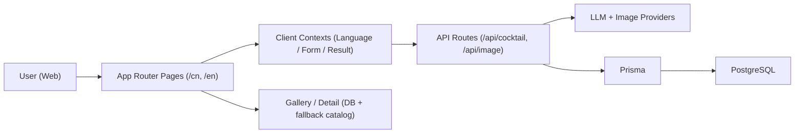

# MoodShaker Frontend

[简体中文](README.zh.md) · English


MoodShaker is an AI-powered, bilingual cocktail recommendation web app.  
It turns a short mood questionnaire into a personalized cocktail recipe with ingredients, tools, steps, and a shareable visual card.

## Highlights

- **AI recommendation pipeline** with two bartender modes (`classic_bartender` / `creative_bartender`).
- **Localized UX** in Chinese and English (`/cn`, `/en`) with path-based routing and auto language redirect.
- **Full cocktail journey**: home → questions → recommendation → gallery → detail page.
- **Image generation + optimization** via external image API, optional `sharp` processing, and DB thumbnail backfill support.
- **Performance-focused client state** using split contexts, async storage batching, request dedup/cache, and dev performance overlay.

## Screenshots

| Home | Questionnaire |
| --- | --- |
|  |  |

| Gallery | Detail |
| --- | --- |
|  |  |

## Tech Stack

- **Framework**: Next.js 16 (App Router), React 19
- **Language**: TypeScript
- **Styling/UI**: Tailwind CSS, Framer Motion, Radix UI, Lucide
- **Data layer**: Prisma + PostgreSQL
- **AI integration**: OpenAI-compatible chat endpoint + image generation endpoint
- **Tooling**: pnpm, ESLint (`next/core-web-vitals` + TypeScript rules)

## Architecture Overview


```mermaid
flowchart LR
  A["User (Web)"] --> B["App Router Pages (/cn, /en)"]
  B --> C["Client Contexts (Language / Form / Result)"]
  C --> D["API Routes (/api/cocktail, /api/image)"]
  D --> E["LLM + Image Providers"]
  D --> F["Prisma"]
  F --> G["PostgreSQL"]
  B --> H["Gallery / Detail (DB + fallback catalog)"]
```

## Project Structure

```text
app/
  [lang]/
    page.tsx
    questions/page.tsx
    gallery/page.tsx
    cocktail/[id]/page.tsx
    cocktail/recommendation/page.tsx
  api/
    cocktail/route.ts
    cocktail/[id]/route.ts
    image/route.ts
components/
context/
locales/
lib/
prisma/
proxy.ts
```

## Getting Started

### 1) Prerequisites

- Node.js **20+**
- pnpm **9+**
- PostgreSQL **15+** (or Docker)

### 2) Install dependencies

```bash
pnpm install
```

### 3) Configure environment

```bash
cp .env.example .env
```

Fill in required API/database values in `.env` (see [Environment Variables](#environment-variables)).

### 4) Prepare database

Make sure PostgreSQL is running and `DATABASE_URL` is reachable, then:

```bash
pnpm db:init
```

This runs Prisma client generation, migration deploy, and seed data.

### 5) Run development server

```bash
pnpm dev
```

Open [http://localhost:3000](http://localhost:3000).  
Root path redirects to language routes (default `/cn`).

## Environment Variables

| Variable | Required | Description |
| --- | --- | --- |
| `OPENAI_API_KEY` | Yes | API key for chat completion endpoint |
| `OPENAI_BASE_URL` | Yes | OpenAI-compatible base URL (keep trailing `/`, e.g. `.../v1/`) |
| `OPENAI_MODEL` | Yes | Chat model name |
| `IMAGE_API_URL` | Yes (for image generation) | Image generation endpoint |
| `IMAGE_API_KEY` | Yes (for image generation) | Image API key |
| `IMAGE_MODEL` | No | Image model name |
| `DATABASE_URL` | Yes for persistent DB mode | PostgreSQL connection string |
| `HOST_PORT` | Optional (Docker Compose) | Exposed web port |
| `POSTGRES_USER` | Optional (Docker Compose) | Database username |
| `POSTGRES_PASSWORD` | Optional (Docker Compose) | Database password |
| `POSTGRES_DB` | Optional (Docker Compose) | Database name |

## Available Scripts

| Command | Description |
| --- | --- |
| `pnpm dev` | Start local development server |
| `pnpm build` | Build production bundle |
| `pnpm start` | Run built app |
| `pnpm lint` | Run ESLint |
| `pnpm db:init` | Prisma generate + migrate deploy + seed |
| `pnpm prisma:generate` | Generate Prisma client |
| `pnpm prisma:migrate` | Apply Prisma migrations |
| `pnpm prisma:seed` | Seed popular cocktails |
| `pnpm prisma:backfill-thumbnails` | Backfill `thumbnail` column from existing images |

## API Endpoints

| Method | Endpoint | Purpose |
| --- | --- | --- |
| `POST` | `/api/cocktail` | Generate cocktail recommendation from questionnaire payload |
| `GET` | `/api/cocktail/:id` | Fetch cocktail detail by id |
| `POST` | `/api/image` | Generate cocktail image and optionally persist optimized image/thumbnail |

## Localization & Routing

- Supported languages: `cn`, `en`
- `proxy.ts` handles language detection from URL, cookie, and `Accept-Language`
- Missing language prefix paths are redirected to localized routes
- Translation dictionaries live in `locales/cn.ts` and `locales/en.ts`

## Docker Deployment

This repo includes:

- `Dockerfile` for multi-stage app image build
- `docker-compose.yml` with `moodshaker-web` + `postgres` services
- `scripts/docker-entrypoint.sh` to init DB schema and seed on container startup

Run:

```bash
docker compose up -d
```

## Troubleshooting

### Prisma `P2022` missing `thumbnail` column

If you see:

```text
The column `cocktails.thumbnail` does not exist in the current database
```

Run:

```bash
pnpm db:init
# or
pnpm prisma:migrate
```

### Recommendation or image API errors

- Verify `.env` keys and endpoint URLs
- Ensure `OPENAI_BASE_URL` is OpenAI-compatible and includes `/v1/`
- Check server logs from `api/openai.ts` and `app/api/*` handlers

## Quality & Validation

There is no automated test runner configured yet. Recommended checks:

```bash
pnpm lint
pnpm build
```

Manual smoke checks:

1. Questionnaire flow and recommendation generation
2. Gallery search + filters
3. Detail page rendering and language switch
4. Share card generation/download

## Contributing

PRs are welcome. Suggested PR content:

- short summary
- related issue (if any)
- verification steps
- screenshots for UI changes
- env/database notes when applicable

## Notes

- AI outputs can be inaccurate; always review recipes and safety constraints.
- Do not commit `.env` or any secret values.
