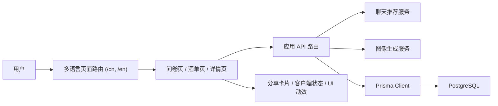

# MoodShaker Frontend

<div align="center">

一个由 AI 驱动的中英双语鸡尾酒体验应用，把一次简短的心情测试变成一杯完整的专属推荐。

[](./README.md)
[](https://nextjs.org/)
[](https://react.dev/)
[](https://www.typescriptlang.org/)
[](https://www.prisma.io/)
[](https://tailwindcss.com/)

[](#项目概览)
[](#页面截图)
[](#快速开始)
[](#系统架构)
[](#部署方式)

</div>

## 目录

- [MoodShaker Frontend](#moodshaker-frontend)
  - [目录](#目录)
  - [项目概览](#项目概览)
  - [为什么是 MoodShaker](#为什么是-moodshaker)
  - [核心亮点](#核心亮点)
  - [页面截图](#页面截图)
    - [当前截图](#当前截图)
  - [体验流程](#体验流程)
  - [技术栈](#技术栈)
  - [系统架构](#系统架构)
    - [运行时组成](#运行时组成)
  - [项目结构](#项目结构)
  - [快速开始](#快速开始)
    - [1. 环境要求](#1-环境要求)
    - [2. 安装依赖](#2-安装依赖)
    - [3. 配置环境变量](#3-配置环境变量)
    - [4. 初始化数据库](#4-初始化数据库)
    - [5. 启动开发环境](#5-启动开发环境)
  - [环境变量](#环境变量)
  - [可用脚本](#可用脚本)
  - [API 接口](#api-接口)
  - [多语言与路由](#多语言与路由)
  - [部署方式](#部署方式)
  - [常见问题](#常见问题)
    - [Prisma `P2022`：缺少 `thumbnail` 字段](#prisma-p2022缺少-thumbnail-字段)
    - [推荐接口或图片接口报错](#推荐接口或图片接口报错)
  - [验证方式](#验证方式)
  - [贡献说明](#贡献说明)
  - [备注](#备注)

## 项目概览

MoodShaker 是一个中英双语鸡尾酒推荐 Web 应用。用户不需要先知道想喝什么，只要先回答一组简短的心情问题，系统就会生成一份更贴近当下情绪的鸡尾酒结果，包含配方、原料、工具、步骤，以及可分享的视觉卡片。

这个项目基于 Next.js App Router、React 19、TypeScript、Prisma 和外部 AI 服务构建，既有推荐生成链路，也有酒单浏览、详情页、多语言切换和图片生成能力，适合继续往“产品化体验”方向打磨。

## 为什么是 MoodShaker

很多鸡尾酒工具要么只是静态配方库，要么只是一个简单的聊天演示。MoodShaker 更像介于两者之间的一种体验：交互足够轻，结果又不只是一次性文本输出。

它的产品路径很清晰：

- 从情绪而不是原料出发
- 生成一杯有风格的鸡尾酒推荐
- 用图片和分享卡片把结果包装完整
- 再通过酒单页和详情页把内容沉淀下来

## 核心亮点

- 内置两种调酒人格模式：`classic_bartender` 和 `creative_bartender`。
- 基于语言前缀的路由设计已经接好，支持 `/cn` 和 `/en`，并在 [`proxy.ts`](./proxy.ts) 中处理自动跳转。
- 核心产品流程已经连通：首页、问卷、推荐结果、酒单页、详情页、分享卡片。
- 图像链路支持外部图片生成接口，也保留了缩略图回填这类后续数据维护能力。
- 前端结构以复用组件、拆分上下文和更稳定的客户端状态管理为中心，方便继续演进。

## 页面截图

### 当前截图

| 首页 | 问卷页 |
| --- | --- |
|  |  |

| 酒单页 | 详情页 |
| --- | --- |
|  |  |

## 体验流程

```text
首页
  -> 心情问卷
  -> AI 生成鸡尾酒推荐
  -> 图片与配方展示
  -> 分享卡片
  -> 酒单浏览
  -> 详情页回看
```

## 技术栈

- 框架：Next.js 16 + App Router
- UI：React 19、Tailwind CSS 4、Framer Motion、Radix UI、Lucide
- 语言：TypeScript
- 数据层：Prisma + PostgreSQL
- 数据请求：SWR
- AI 集成：兼容 OpenAI 的聊天接口与图像生成接口
- 工具链：pnpm、ESLint、tsx、Docker Compose

## 系统架构



### 运行时组成

- 用户页面主要位于 [`app/[lang]`](./app/%5Blang%5D)。
- API 处理器位于 [`app/api`](./app/api)，负责推荐生成、详情查询和图像生成。
- 可复用 UI 组件位于 [`components`](./components)，全局状态管理位于 [`context`](./context)。
- 数据库 schema、迁移、种子数据和维护脚本位于 [`prisma`](./prisma)。

## 项目结构

```text
app/
  api/
    cocktail/
    image/
  [lang]/
    page.tsx
    questions/page.tsx
    gallery/page.tsx
    cocktail/[id]/page.tsx
    cocktail/recommendation/page.tsx
components/
  animations/
  layout/
  pages/
  share/
  ui/
context/
docs/
  screenshots/
lib/
locales/
prisma/
public/
proxy.ts
```

## 快速开始

### 1. 环境要求

- Node.js `>= 22`
- pnpm `>= 10`
- PostgreSQL `15+` 或 Docker

### 2. 安装依赖

```bash
pnpm install
```

### 3. 配置环境变量

```bash
cp .env.example .env
```

然后把 `.env` 中需要的配置补齐。

### 4. 初始化数据库

确保 PostgreSQL 已经启动，且 `DATABASE_URL` 可以连接：

```bash
pnpm db:init
```

这个命令会依次完成：

- 生成 Prisma Client
- 执行迁移
- 写入初始鸡尾酒数据

### 5. 启动开发环境

```bash
pnpm dev
```

打开 [http://localhost:3000](http://localhost:3000)。  
访问根路径 `/` 时，会自动跳转到对应语言路由，默认是 `/cn`。

## 环境变量

| 变量名 | 必填 | 说明 |
| --- | --- | --- |
| `OPENAI_API_KEY` | 是 | 聊天推荐接口所需 API Key |
| `OPENAI_BASE_URL` | 是 | 兼容 OpenAI 的基础地址，例如 `https://api.siliconflow.cn/v1/` |
| `OPENAI_MODEL` | 是 | 聊天模型名称 |
| `IMAGE_API_URL` | 图片功能必填 | 图像生成接口地址 |
| `IMAGE_API_KEY` | 图片功能必填 | 图像生成接口 Key |
| `IMAGE_MODEL` | 否 | 图像模型名称 |
| `DATABASE_URL` | 是 | PostgreSQL 连接字符串 |
| `HOST_PORT` | 可选 | Docker Compose 暴露端口 |
| `POSTGRES_USER` | 可选 | Docker Compose 数据库用户名 |
| `POSTGRES_PASSWORD` | 可选 | Docker Compose 数据库密码 |
| `POSTGRES_DB` | 可选 | Docker Compose 数据库名 |

## 可用脚本

| 命令 | 说明 |
| --- | --- |
| `pnpm dev` | 启动本地开发服务器 |
| `pnpm build` | 构建生产版本 |
| `pnpm start` | 启动生产构建 |
| `pnpm lint` | 运行 ESLint |
| `pnpm db:init` | 生成 Prisma Client、执行迁移并写入种子数据 |
| `pnpm prisma:generate` | 只生成 Prisma Client |
| `pnpm prisma:migrate` | 执行 Prisma 迁移 |
| `pnpm prisma:seed` | 写入鸡尾酒种子数据 |
| `pnpm prisma:backfill-thumbnails` | 回填 `thumbnail` 字段 |

## API 接口

| 方法 | 路径 | 作用 |
| --- | --- | --- |
| `POST` | `/api/cocktail` | 根据问卷输入生成鸡尾酒推荐 |
| `GET` | `/api/cocktail/:id` | 按 id 获取鸡尾酒详情 |
| `POST` | `/api/image` | 生成鸡尾酒图片，并可选地持久化优化后的资源 |

## 多语言与路由

- 当前支持 `cn` 和 `en` 两种语言。
- [`proxy.ts`](./proxy.ts) 会根据 URL、Cookie 和 `Accept-Language` 头判断语言。
- 没有语言前缀的请求会自动重定向到对应语言路径。
- 词典文件位于 [`locales/cn.ts`](./locales/cn.ts) 和 [`locales/en.ts`](./locales/en.ts)。

## 部署方式

仓库里已经准备好了容器化部署所需的主要文件：

- [`Dockerfile`](./Dockerfile) 用于多阶段构建
- [`docker-compose.yml`](./docker-compose.yml) 用于同时启动 Web 和 PostgreSQL
- [`scripts/docker-entrypoint.sh`](./scripts/docker-entrypoint.sh) 负责启动时的 schema 初始化与 seed 处理

本地运行 Docker：

```bash
docker compose up -d
```

## 常见问题

### Prisma `P2022`：缺少 `thumbnail` 字段

如果你看到：

```text
The column `cocktails.thumbnail` does not exist in the current database
```

执行：

```bash
pnpm db:init
```

如果数据库已存在，只是迁移未同步，也可以尝试：

```bash
pnpm prisma:migrate
```

### 推荐接口或图片接口报错

- 先检查 `.env` 里的 key 和 URL 是否正确。
- 确认 `OPENAI_BASE_URL` 指向兼容 OpenAI 的接口地址。
- 再查看 [`app/api`](./app/api) 下相关处理器的服务端日志。

## 验证方式

当前仓库还没有专门的自动化测试框架，所以最基础也最重要的检查是：

```bash
pnpm lint
pnpm build
```

建议再做一轮手动冒烟验证：

1. 完整走一遍问卷并确认推荐结果能正常生成。
2. 进入酒单页，检查浏览、搜索或筛选是否正常。
3. 打开详情页并切换语言，确认内容和跳转都正常。
4. 如果动到了分享卡片相关逻辑，再检查生成与下载流程。

## 贡献说明

如果你准备提交 PR，建议至少包含这些信息：

- 一段简短的改动摘要
- 关联 issue 或背景说明
- 你的验证步骤
- UI 改动截图
- 涉及环境变量或数据库时的额外说明

## 备注

- AI 生成内容不能直接当作绝对准确结果，实际使用前仍建议复核。
- 不要提交 `.env` 或任何生产密钥。
