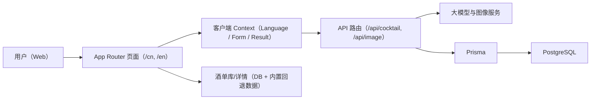

# MoodShaker Frontend

简体中文 · [English](README.md)


MoodShaker 是一个 AI 驱动的双语鸡尾酒推荐 Web 应用。  
用户通过简短的心情问卷，即可获得个性化配方（原料、工具、步骤）以及可分享的视觉卡片。

## 核心亮点

- **AI 推荐链路**：支持两种调酒代理模式（`classic_bartender` / `creative_bartender`）。
- **中英双语体验**：基于路径前缀的本地化路由（`/cn`、`/en`）与自动语言跳转。
- **完整产品流程**：首页 → 问卷 → 推荐页 → 酒单库 → 详情页。
- **图像生成与优化**：接入图像生成 API，可选 `sharp` 优化，并支持缩略图回填。
- **性能优化导向**：拆分 Context、异步存储批处理、请求去重缓存、开发环境性能面板。

## 页面截图

| 首页 | 问卷 |
| --- | --- |
|  |  |

| 酒单库 | 详情页 |
| --- | --- |
|  |  |

## 技术栈

- **框架**：Next.js 16（App Router）、React 19
- **语言**：TypeScript
- **样式/UI**：Tailwind CSS、Framer Motion、Radix UI、Lucide
- **数据层**：Prisma + PostgreSQL
- **AI 集成**：兼容 OpenAI 的聊天接口 + 图像生成接口
- **工程化**：pnpm、ESLint（`next/core-web-vitals` + TypeScript 规则）

## 架构概览



## 目录结构

```text
app/
  [lang]/
    page.tsx
    questions/page.tsx
    gallery/page.tsx
    cocktail/[id]/page.tsx
    cocktail/recommendation/page.tsx
  api/
    cocktail/route.ts
    cocktail/[id]/route.ts
    image/route.ts
components/
context/
locales/
lib/
prisma/
proxy.ts
```

## 快速开始

### 1）环境要求

- Node.js **20+**
- pnpm **9+**
- PostgreSQL **15+**（或 Docker）

### 2）安装依赖

```bash
pnpm install
```

### 3）配置环境变量

```bash
cp .env.example .env
```

在 `.env` 中填入 API 与数据库配置（见[环境变量说明](#环境变量说明)）。

### 4）初始化数据库

确保 PostgreSQL 已启动，且 `DATABASE_URL` 可连接，然后执行：

```bash
pnpm db:init
```

该命令会依次执行 Prisma Client 生成、迁移部署和初始数据写入。

### 5）启动开发环境

```bash
pnpm dev
```

打开 [http://localhost:3000](http://localhost:3000)。  
根路径会自动跳转到语言路由（默认 `/cn`）。

## 环境变量说明

| 变量名 | 必填 | 说明 |
| --- | --- | --- |
| `OPENAI_API_KEY` | 是 | 聊天补全接口 API Key |
| `OPENAI_BASE_URL` | 是 | OpenAI 兼容基础地址（建议保留结尾 `/`，例如 `.../v1/`） |
| `OPENAI_MODEL` | 是 | 聊天模型名称 |
| `IMAGE_API_URL` | 图像功能必填 | 图像生成接口地址 |
| `IMAGE_API_KEY` | 图像功能必填 | 图像生成接口 Key |
| `IMAGE_MODEL` | 否 | 图像模型名称 |
| `DATABASE_URL` | 持久化模式必填 | PostgreSQL 连接字符串 |
| `HOST_PORT` | 可选（Docker Compose） | Web 暴露端口 |
| `POSTGRES_USER` | 可选（Docker Compose） | 数据库用户名 |
| `POSTGRES_PASSWORD` | 可选（Docker Compose） | 数据库密码 |
| `POSTGRES_DB` | 可选（Docker Compose） | 数据库名称 |

## 常用命令

| 命令 | 说明 |
| --- | --- |
| `pnpm dev` | 启动本地开发服务器 |
| `pnpm build` | 构建生产包 |
| `pnpm start` | 启动生产构建 |
| `pnpm lint` | 运行 ESLint |
| `pnpm db:init` | Prisma generate + migrate deploy + seed |
| `pnpm prisma:generate` | 生成 Prisma Client |
| `pnpm prisma:migrate` | 执行 Prisma 迁移 |
| `pnpm prisma:seed` | 写入热门鸡尾酒种子数据 |
| `pnpm prisma:backfill-thumbnails` | 根据已有图片回填 `thumbnail` 字段 |

## API 接口

| 方法 | 路径 | 用途 |
| --- | --- | --- |
| `POST` | `/api/cocktail` | 根据问卷载荷生成鸡尾酒推荐 |
| `GET` | `/api/cocktail/:id` | 按 id 获取鸡尾酒详情 |
| `POST` | `/api/image` | 生成鸡尾酒图片，并可选持久化优化图与缩略图 |

## 本地化与路由

- 支持语言：`cn`、`en`
- `proxy.ts` 基于 URL、Cookie、`Accept-Language` 执行语言检测
- 无语言前缀路径会重定向到对应语言路径
- 词典位于 `locales/cn.ts` 与 `locales/en.ts`

## Docker 部署

仓库提供：

- 多阶段构建 `Dockerfile`
- 包含 `moodshaker-web` 与 `postgres` 的 `docker-compose.yml`
- 容器启动时自动初始化数据库的 `scripts/docker-entrypoint.sh`

运行：

```bash
docker compose up -d
```

## 故障排查

### Prisma `P2022`：缺少 `thumbnail` 列

如果看到：

```text
The column `cocktails.thumbnail` does not exist in the current database
```

执行：

```bash
pnpm db:init
# 或
pnpm prisma:migrate
```

### 推荐/图像 API 报错

- 检查 `.env` 中的 Key 与 URL 是否正确
- 确认 `OPENAI_BASE_URL` 为兼容地址且包含 `/v1/`
- 查看 `api/openai.ts` 与 `app/api/*` 日志输出

## 质量检查与验证

当前仓库尚未配置自动化测试框架。建议至少执行：

```bash
pnpm lint
pnpm build
```

手工冒烟建议：

1. 问卷流程与推荐生成
2. 酒单库搜索与筛选
3. 详情页渲染与语言切换
4. 分享卡片生成与下载

## 贡献指南

欢迎提交 PR。建议包含：

- 变更摘要
- 关联 issue（如有）
- 验证步骤
- UI 变更截图
- 环境变量/数据库相关说明（如涉及）

## 说明

- AI 生成内容可能不完全准确，请在实际使用前复核。
- 请勿提交 `.env` 或任何密钥信息。
