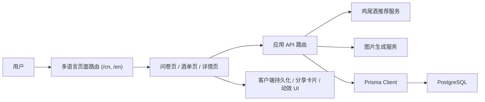

# MoodShaker Frontend

<div align="center">

一个由 AI 驱动的中英双语鸡尾酒体验应用，把一次简短的心情测试变成一杯完整的专属推荐。

[](./README.md)
[](https://nextjs.org/)
[](https://react.dev/)
[](https://www.typescriptlang.org/)
[](https://www.prisma.io/)
[](https://tailwindcss.com/)

[](#项目概览)
[](#当前状态)
[](#快速开始)
[](#部署与发版)

</div>

## 项目概览

MoodShaker 是一个中英双语鸡尾酒推荐 Web 应用。用户不需要先知道想喝什么，只要先回答一组简短的心情问题，系统就会生成一份更贴近当下情绪的鸡尾酒结果，包含配方、原料、工具、步骤，以及可分享的视觉卡片。

这个项目基于 Next.js App Router、React 19、TypeScript、Prisma、PostgreSQL 和外部 AI 服务构建，已经连通推荐生成、图片生成、酒单浏览、详情页和双语切换等主要链路。

## 当前状态

### 实施进度

- Batch 1 加固已经完成：本地验证恢复、私有推荐不再通过 URL 传输 `editToken`、不安全的通配 CORS 头已移除、API 500 输出已统一、共享限流存储已接入。
- 仓库已经具备基础自动化验证能力，支持 `pnpm test`。
- 推荐恢复当前是“同一浏览器会话内的私有访问”模型。若本地编辑访问能力丢失，页面会明确提示不可恢复，而不是伪成功。

### 发版状态

- 适合本地开发、预发环境和小范围 beta。
- 还不建议直接作为正式生产版全量发布。

正式发版阻塞项见 [docs/release-readiness.md](./docs/release-readiness.md)。

## 核心亮点

- 支持两种调酒人格：`classic_bartender` 和 `creative_bartender`。
- 已完成基于 `/cn` 和 `/en` 的语言路由，并通过 [proxy.ts](./proxy.ts) 做自动跳转。
- 核心产品链路已串通：首页、问卷、推荐结果、酒单页、详情页、分享卡片。
- 私有推荐默认受保护，访问需要推荐 id 和本地 `editToken`。
- 服务端接口使用稳定错误码，500 不再直接向客户端泄露内部错误。
- 推荐和图片接口会返回限流响应头，并支持基于 Postgres 的共享限流桶。

## 页面截图

| 首页 | 问卷页 |
| --- | --- |
|  |  |

| 酒单页 | 详情页 |
| --- | --- |
|  |  |

## 体验流程

```text
首页
  -> 心情问卷
  -> AI 生成鸡尾酒推荐
  -> 图片与配方展示
  -> 分享卡片
  -> 酒单浏览
  -> 详情页回看
```

## 技术栈

- 框架：Next.js 16 + App Router
- UI：React 19、Tailwind CSS 4、Framer Motion、Radix UI、Lucide
- 语言：TypeScript
- 数据层：Prisma + PostgreSQL
- 数据请求：SWR
- AI 集成：兼容 OpenAI 的聊天接口与图像生成接口
- 工具链：pnpm、ESLint、tsx、Docker Compose

## 系统架构



### 运行时组成

- 用户页面主要位于 [app/[lang]](./app/%5Blang%5D)。
- API 处理器位于 [app/api](./app/api)，负责推荐生成、详情查询、图片生成和私有推荐读取。
- 可复用 UI 组件位于 [components](./components)，全局状态管理位于 [context](./context)。
- 数据库 schema、迁移、种子数据和维护脚本位于 [prisma](./prisma)。
- 当前整改记录和性能说明位于 [docs](./docs)。

## 项目结构

```text
app/
  api/
    cocktail/
    image/
    recommendation/
  [lang]/
    page.tsx
    questions/page.tsx
    gallery/page.tsx
    cocktail/[id]/page.tsx
    cocktail/recommendation/page.tsx
components/
  animations/
  layout/
  pages/
  share/
  ui/
context/
docs/
  plans/
  screenshots/
lib/
locales/
prisma/
public/
tests/
proxy.ts
```

## 快速开始

### 1. 环境要求

- Node.js `>= 22`
- pnpm `>= 10`
- PostgreSQL `15+` 或 Docker

### 2. 安装依赖

```bash
pnpm install
```

安装完成后会通过 `postinstall` 自动执行 `prisma generate`，通常不需要手动补生成 Prisma Client。

### 3. 配置环境变量

```bash
cp .env.example .env
```

然后把 `.env` 中需要的配置补齐。

### 4. 初始化数据库

确保 PostgreSQL 已经启动，且 `DATABASE_URL` 可以连接：

```bash
pnpm db:init
```

这个命令会依次完成：

- 生成 Prisma Client
- 执行迁移
- 写入初始鸡尾酒数据

### 5. 启动开发环境

```bash
pnpm dev
```

打开 [http://localhost:3000](http://localhost:3000)。访问根路径 `/` 时，会自动跳转到对应语言路由，默认是 `/cn`。

## 环境变量

| 变量名 | 必填 | 说明 |
| --- | --- | --- |
| `OPENAI_API_KEY` | 是 | 聊天推荐接口所需 API Key |
| `OPENAI_BASE_URL` | 是 | 兼容 OpenAI 的基础地址 |
| `OPENAI_MODEL` | 是 | 聊天模型名称 |
| `IMAGE_API_URL` | 图片功能必填 | 图像生成接口地址 |
| `IMAGE_API_KEY` | 图片功能必填 | 图像生成接口 Key |
| `IMAGE_MODEL` | 否 | 图像模型名称 |
| `IMAGE_FETCH_HOST_ALLOWLIST` | 建议配置 | 服务端抓取并优化远程图片时使用的主机白名单，多个值用逗号分隔 |
| `DATABASE_URL` | 是 | PostgreSQL 连接字符串 |
| `HOST_PORT` | 可选 | Docker Compose 暴露端口 |
| `POSTGRES_USER` | 可选 | Docker Compose 数据库用户名 |
| `POSTGRES_PASSWORD` | 可选 | Docker Compose 数据库密码 |
| `POSTGRES_DB` | 可选 | Docker Compose 数据库名 |

## 可用脚本

| 命令 | 说明 |
| --- | --- |
| `pnpm dev` | 启动本地开发服务器 |
| `pnpm build` | 构建生产版本 |
| `pnpm start` | 启动生产构建 |
| `pnpm lint` | 运行 ESLint |
| `pnpm test` | 运行轻量级 Node 回归测试 |
| `pnpm db:init` | 生成 Prisma Client、执行迁移并写入种子数据 |
| `pnpm prisma:generate` | 只生成 Prisma Client |
| `pnpm prisma:migrate` | 执行 Prisma 迁移 |
| `pnpm prisma:seed` | 写入鸡尾酒种子数据 |
| `pnpm prisma:backfill-thumbnails` | 回填 `thumbnail` 字段 |

## API 接口

| 方法 | 路径 | 作用 |
| --- | --- | --- |
| `POST` | `/api/cocktail` | 根据问卷输入生成鸡尾酒推荐 |
| `GET` | `/api/cocktail/:id` | 按 id 获取公开鸡尾酒详情 |
| `POST` | `/api/image` | 在具备编辑权限时生成或刷新推荐图片 |
| `POST` | `/api/recommendation/:id` | 通过 JSON body 中的 `editToken` 读取私有推荐 |

### 安全与行为说明

- 私有推荐不再接受 URL 中的 `editToken`。
- `POST /api/recommendation/:id` 返回的元数据中不会回传 `editToken`。
- `POST /api/cocktail` 目前按客户端 IP 限流。
- `POST /api/image` 目前按推荐 id 限流。
- 在生产环境里，如果共享限流表缺失，会被视为部署错误，而不是长期静默降级。

## 多语言与路由

- 当前支持 `cn` 和 `en` 两种语言。
- [proxy.ts](./proxy.ts) 会根据 URL、Cookie 和 `Accept-Language` 头判断语言。
- 没有语言前缀的请求会自动重定向到对应语言路径。
- 词典文件位于 [locales/cn.ts](./locales/cn.ts) 和 [locales/en.ts](./locales/en.ts)。

## 部署与发版

仓库里已经准备好了容器化部署所需的主要文件：

- [Dockerfile](./Dockerfile) 用于多阶段构建
- [docker-compose.yml](./docker-compose.yml) 用于同时启动 Web 和 PostgreSQL
- [scripts/docker-entrypoint.sh](./scripts/docker-entrypoint.sh) 用于启动时初始化 schema 和 seed

### 最低部署检查清单

1. 配齐所有必需环境变量。
2. 在目标数据库执行 Prisma migration。
3. 确认 `rate_limit_buckets` 表已经存在。
4. 执行验证命令：

```bash
pnpm test
pnpm lint
pnpm build
```

5. 做一轮手工 smoke：
   - 首页 -> 问卷 -> 推荐
   - 图片生成 / 刷新
   - 同一浏览器会话中的推荐恢复
   - 酒单搜索和筛选
   - 中英文详情页切换

### 当前发版提醒

项目暂时还不适合直接全量正式发布。在从 staging / beta 提升到生产前，请先阅读 [docs/release-readiness.md](./docs/release-readiness.md)。

## 常见问题

### Prisma `P2022`：缺少 `thumbnail` 字段

如果你看到：

```text
The column `cocktails.thumbnail` does not exist in the current database
```

运行：

```bash
pnpm db:init
```

如果数据库已经存在，只是漏跑了迁移，也可以先执行：

```bash
pnpm prisma:migrate
```

### 部署后立刻触发限流错误

如果加固批次之后，生产环境的推荐或图片请求刚上线就失败，请先确认最新 Prisma migration 是否已经执行，以及 `rate_limit_buckets` 表是否存在。

### 推荐接口或图片接口报错

- 检查 `.env` 里的 key 和 URL 是否正确。
- 确认 `OPENAI_BASE_URL` 指向兼容 OpenAI 的接口。
- 确认 `IMAGE_FETCH_HOST_ALLOWLIST` 包含了允许服务端抓取并优化的远程图片主机。
- 查看 [app/api](./app/api) 下相关接口的服务端日志。

### 私有推荐无法重新打开

当前私有推荐恢复是“同一浏览器会话”模型。如果本地编辑访问能力已经丢失，应用会明确提示该推荐不可恢复，并引导用户重新生成。

## 验证方式

当前仓库的基础验证命令是：

```bash
pnpm test
pnpm lint
pnpm build
```

如果在某些环境里安装依赖后 Prisma Client 没有生成，可以在 `pnpm build` 之前补跑一次：

```bash
pnpm prisma:generate
```

推荐的手工 smoke 检查：

1. 完成问卷并确认推荐可生成。
2. 刷新推荐图片，并确认限流反馈正常。
3. 在同一浏览器会话中重新打开私有推荐。
4. 在缺少本地访问能力时，确认推荐页展示明确的 unavailable 状态。
5. 浏览酒单并确认搜索和筛选正常。
6. 打开详情页并切换语言。
7. 如果改动涉及分享功能，确认分享卡片生成和下载正常。

## 项目文档

- [docs/release-readiness.md](./docs/release-readiness.md)：当前 staging 与生产发版状态
- [docs/performance-baseline.md](./docs/performance-baseline.md)：本地验证基线与已知瓶颈
- [docs/plans/2026-04-07-moodshaker-remediation-implementation-plan.md](./docs/plans/2026-04-07-moodshaker-remediation-implementation-plan.md)：整改计划和当前阶段状态

## 贡献说明

如果你要提交 PR，建议附上：

- 简短变更说明
- 关联 issue 或上下文
- 验证步骤
- UI 变更截图
- 环境变量或数据库变更说明

## 备注

- AI 生成内容不能替代真实世界场景下的专业判断。
- 不要提交 `.env` 或任何生产环境密钥。
- 当前自动化测试覆盖仍然偏轻量，`pnpm test` 主要用于回归保护，不替代端到端验证。
